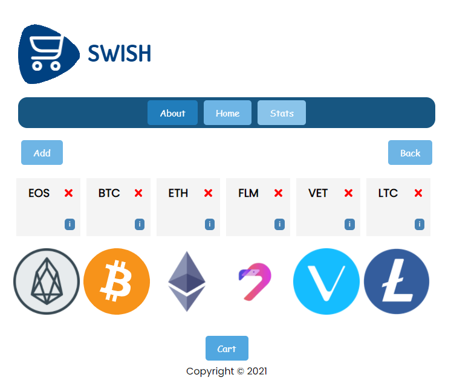
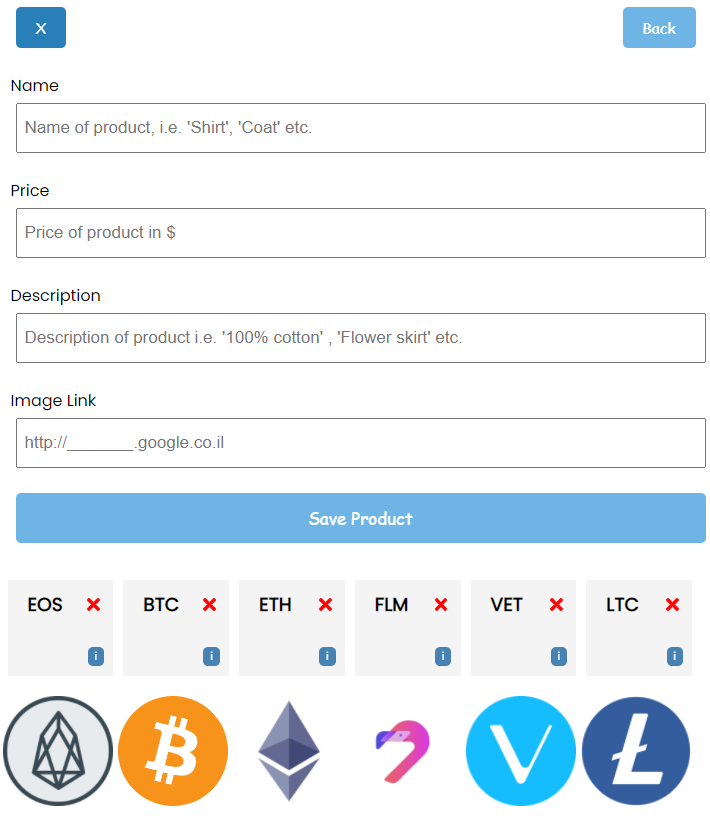
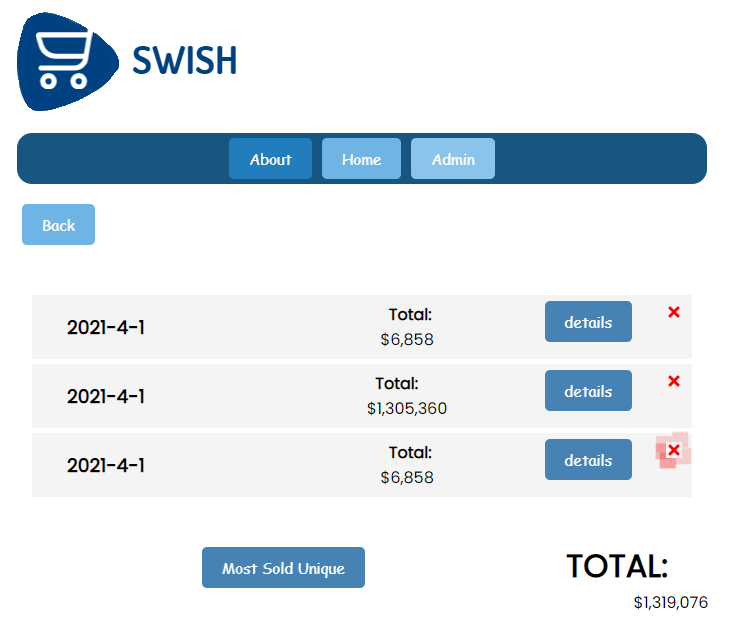
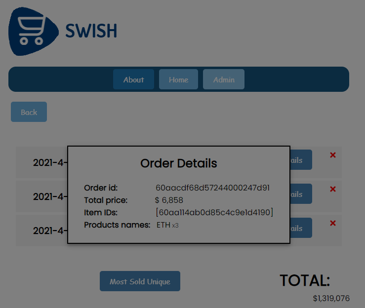
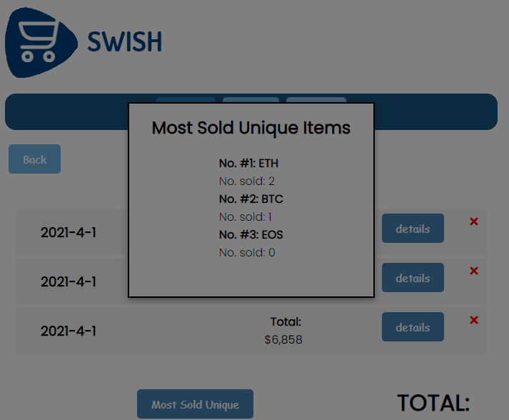
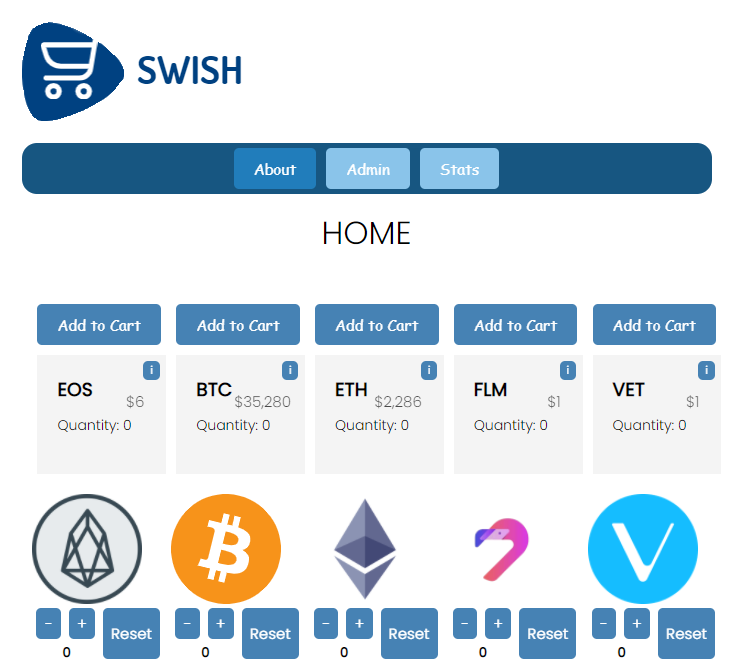
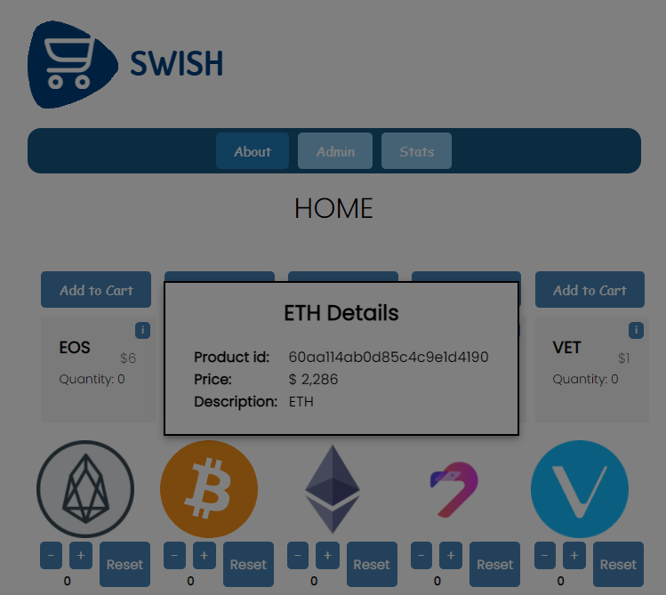
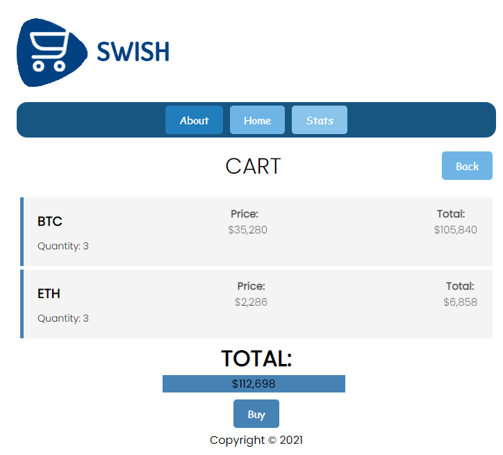
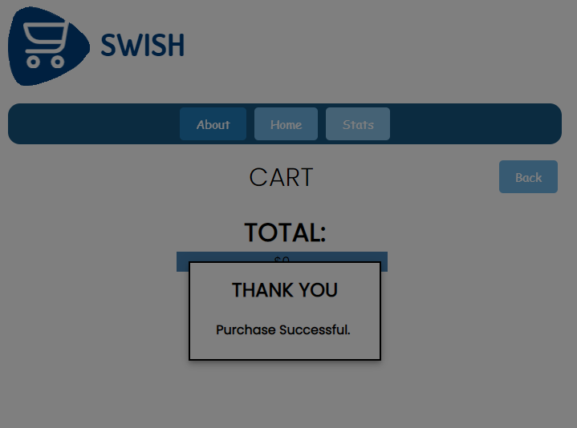

# 'Swish'
## React shop
### Table of contents
* [General Info](#general-info)
* [Tabs list](#tabs-list)
* [License](#license)

### General Info

Swish is a mobile-ready shop, offline-storage compatible,
ReactJS based.

### Tabs list

- [Admin](#admin)
    1. [Add Product](#add-product)
- [Stats](#stats)
    1. [Order-Details](#order-details)
    2. [Most-Sold](#most-sold)
- [Home](#home)
    1. [Item-Details](#item-Details)
- [Cart](#cart)
    1. [Purchase](#purchase)

##### Admin

- ###### Add Product

##### Stats

- ###### Order-Details
 

- ###### Most-Sold

##### Home

- ###### Item-Details

##### Cart

- ###### Purchase

## License

MIT

